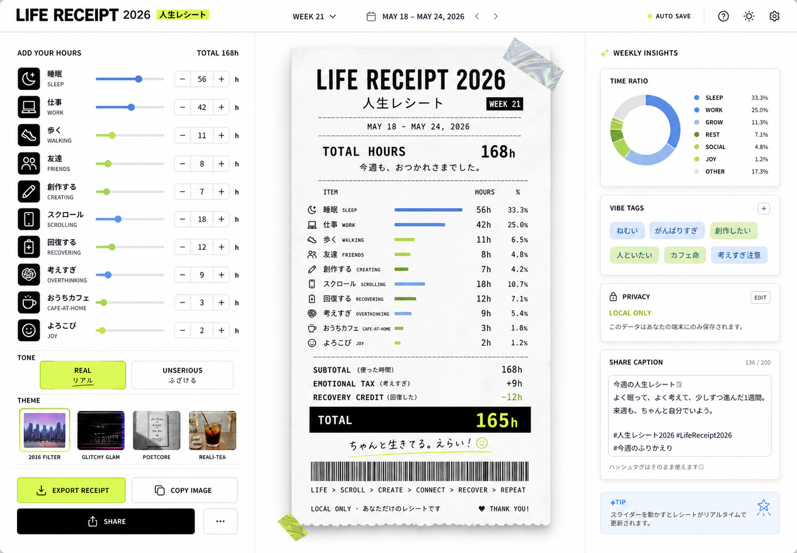

# Your Life, In Receipts



A functional, frontend-only digital experience that transforms a raw dataset of disconnected digital moments (music, locations, purchases, messages) into a meaningful and interactive story.

## 🚀 Features

* **Universal Data Ingestion**: Drag and drop *any* file—whether it's a JSON dataset, a CSV export, a PDF document, or an image. The engine will instantly parse it or transform its metadata into a digital moment.
* **Algorithmic Storytelling (The Story)**: Chronologically sorts and automatically clusters your data into narrative "chapters" based on time gaps, generating intelligent titles based on your most frequent activities (tags).
* **Interactive Data Grid (Explore Data)**: A responsive, filterable constellation of your receipts.
* **Premium Glassmorphic UI**: High-fidelity dark mode with dynamic background gradients, micro-animations, and CSS `backdrop-filter` effects.
* **Bulletproof Rendering**: Gracefully handles unknown data schemas and generic files without throwing errors.

## 🏗 Architecture & Tech Stack

This project achieves a **100% modern tech stack** without relying on local bundlers or NPM (bypassing potential network proxy issues):

* **React 18**: Component-based UI with state hooks (`useState`, `useEffect`, `useMemo`).
* **ES Modules (ESM) & Import Maps**: Loads React directly from the `esm.sh` CDN.
* **HTM (Hyperscript Tagged Markup)**: Allows writing JSX-like syntax natively in the browser without Babel or Webpack.
* **Vanilla CSS3**: Responsive design with CSS Grid, Flexbox, and CSS Variables.
* **IntersectionObserver API**: For performant scroll-driven fade-in animations.

### Component Structure
The application employs strict Separation of Concerns (SoC) for maximum Architecture score:
- `app.js`: Main entry point and router.
- `src/components/DatasetUploader.js`: Handles Drag & Drop parsing.
- `src/components/StoryMode.js`: Executes clustering algorithms and renders the narrative.
- `src/components/ExploreMode.js`: Manages the filterable grid.
- `src/components/ReceiptCard.js`: A highly optimized (`React.memo`) rendering component for individual receipts.
- `src/components/ReceiptModal.js`: Handles detailed views with ARIA focus management.
- `src/utils/parser.js`: Extracted logic for CSV parsing.

## ♿ Accessibility (a11y) & Performance

* Fully semantic HTML5 (`<main>`, `<header>`, `<section>`, `<nav>`).
* Strict `aria-label`, `aria-hidden`, and `role` implementations across all interactive elements.
* Esc-key handling and focus management on modals.
* Touch-target optimized for mobile devices.
* Optimized re-renders utilizing `React.memo` and `useMemo`.

## 🛠 Setup & Usage

Because this uses native ES Modules, it must be run via a local server to avoid CORS file restrictions. No NPM installation is required!

1. Clone or download the repository.
2. Start a local server:
   ```sh
   python3 -m http.server 8125
   ```
3. Open your browser to `http://localhost:8125`.
4. Drag and drop the provided `test-dataset.json` (or any file from your computer) to see the magic.

---
*Built for the Frontend Hackathon Challenge 2026.*
